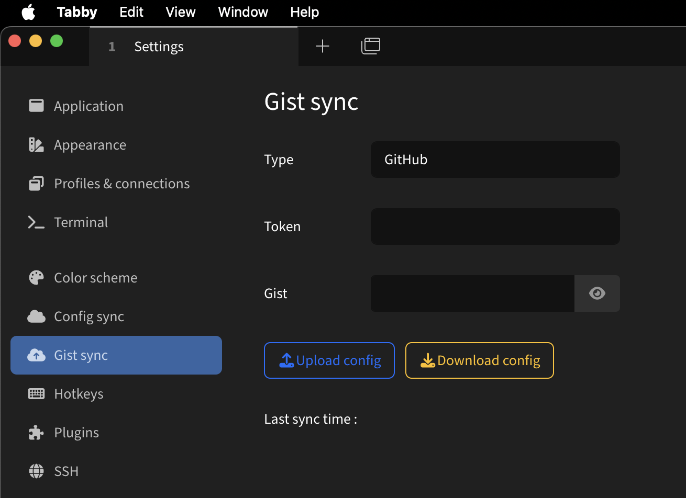

# Gist config sync

### For the [Tabby](https://github.com/Eugeny/tabby) terminal

This plugin allows you sync your tabby.sh configuration via GitHub/GitLab/Gitee Gists.
For additional security plugin encrypts entire configuration with AES-256-CBC.

### Usage
1. Create secret [gist](https://gist.github.com/)
2. Generate token with read/write access to your gists
3. Install [plugin](https://github.com/deadly-octopus/Tabby-Gist-sync/releases/latest)
4. Use your secret gist URL and token to sync your config in plugin settings

